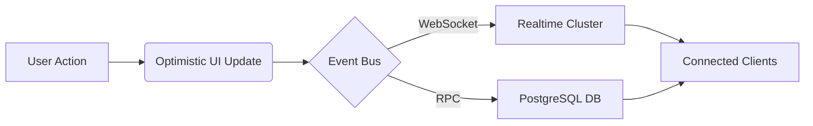

# Kibo System Card

**Model Name:** Kibo v2  
**Model Type:** Career Orchestration Protocol  
**Publisher:** Kibo Systems Research  
**Release Date:** 2026

## Abstract

Kibo is a cloud-native, real-time platform designed to quantify and accelerate technical skill acquisition. By integrating gamification mechanics with verified coding environments, Kibo addresses the "verification gap" in technical recruitment. This system leverages a serverless event-driven architecture to provide instantaneous state synchronization, enabling a high-fidelity feedback loop between user action and skill accreditation.

We are releasing **Kibo v2** to explore the intersection of psychoacoustic feedback, gamified incentives, and rigorous assessment standards.

---

## 1. System Capabilities

Kibo v2 introduces several novel capabilities distinguishing it from traditional learning management systems (LMS):

### 1.1 Real-time State Synchronization
Utilizing PostgreSQL logical replication (via Supabase Realtime), Kibo achieves sub-100ms latency for state propagation across distributed clients. This enables:
- **Live Leaderboards:** Instantaneous ranking updates based on XP ingress.
- **Collaborative Presence:** Real-time user visibility and activity tracking.

### 1.2 Gamification-as-Verification
We propose a model where engagement metrics serve as a proxy for verified productivity.
- **The Garden:** A contribution graph visualizing sustained effort over time.
- **StatsHUD:** A 3D-rendered, gamified dashboard providing immediate visual reinforcement of streaks and leveling progress.

### 1.3 Certified Assessment Engine
The platform includes a proctored-grade exam environment features:
- **Adaptive Audio Feedback:** Context-aware soundscapes (e.g., silent coding modes vs. audible confirmations) to minimize cognitive load.
- **Premium Identity:** Verifiable digital credentials presented via a high-end glassmorphism interface.

## 2. Technical Architecture

Kibo leverages a modern stack optimized for type safety and performance.

| Component | Specification |
|-----------|---------------|
| **Frontend Runtime** | React 18 / Vite |
| **State Primitives** | TanStack Query / Context API |
| **Backend Service** | Supabase (PostgreSQL 15 + Edge Functions) |
| **Styling Engine** | Tailwind CSS + Shadcn UI |
| **Protocol** | WebSocket (Realtime) + REST |



## 3. Usage & Deployment

### Locals
To run the research preview locally:

```bash
git clone https://github.com/Cyrax321/kibo-v6.git
npm install
npm run dev
```

### Environment
Requires a connected Supabase instance with the following schema access:
- `auth.users`
- `public.profiles` (RLS enabled)
- `public.achievements`

## 4. Limitations & Safety

- **Verification Scope:** Current skill verification is limited to algorithmic problem solving and multiple-choice constraints.
- **Device Support:** 3D HUD elements require WebGL-capable devices; fallback modes are available for low-power contexts.

## 5. Citation

If you use Kibo in your research or recruitment pipelines, please cite:

```bibtex
@software{kibo2026,
  author = {Kibo Systems Research},
  title = {Kibo: A Protocol for Verified Skill Acquisition},
  year = {2026},
  url = {https://github.com/Cyrax321/kibo-v6}
}
```
