# 11 – Database Schema Deep Dive

## Database: PostgreSQL 15 (via Supabase)

## Entity Relationship Diagram (Mermaid)

```mermaid
erDiagram
    AUTH_USERS {
        uuid id PK
        text email
        jsonb raw_user_meta_data
    }

    PROFILES {
        uuid id PK
        uuid user_id FK "UNIQUE → auth.users"
        text full_name
        text headline
        text bio
        text avatar_url
        text role "Student | Professional"
        text target "FAANG | Startups | Fintech | Other"
        text country
        integer xp "DEFAULT 0"
        integer level "DEFAULT 1"
        integer streak "DEFAULT 0"
        date last_active
        integer problems_solved "DEFAULT 0"
        integer applications_count "DEFAULT 0"
        text_arr skills "TEXT[]"
        text github_url
        text linkedin_url
        timestamptz created_at
        timestamptz updated_at
    }

    APPLICATIONS {
        uuid id PK
        uuid user_id FK "→ auth.users"
        text company "NOT NULL"
        text role "NOT NULL"
        text status "wishlist|applied|oa|technical|hr|offer"
        text notes
        text salary
        text location
        boolean is_remote
        text job_url
        timestamptz applied_at
        timestamptz created_at
        timestamptz updated_at
    }

    CODING_PROBLEMS {
        uuid id PK
        text title "NOT NULL"
        text description "NOT NULL"
        text difficulty "easy|medium|hard"
        text_arr company_tags "TEXT[]"
        text_arr topic_tags "TEXT[]"
        jsonb starter_code "Per-language templates"
        jsonb sample_cases "Public examples"
        jsonb test_cases "Hidden test cases"
        text editorial_content
        text constraints
        timestamptz created_at
    }

    SUBMISSIONS {
        uuid id PK
        uuid user_id FK "→ auth.users"
        uuid problem_id FK "→ coding_problems"
        text code "NOT NULL"
        text language "NOT NULL"
        text status "accepted|wrong_answer|runtime_error|time_limit|pending"
        integer runtime_ms
        integer memory_kb
        jsonb test_results
        timestamptz created_at
    }

    ASSESSMENTS {
        uuid id PK
        text title "NOT NULL"
        text company "NOT NULL"
        integer duration_minutes "DEFAULT 60"
        uuid_arr problem_ids "UUID[]"
        text difficulty "easy|medium|hard"
        text description
        numeric success_rate
        timestamptz created_at
    }

    ASSESSMENT_ATTEMPTS {
        uuid id PK
        uuid user_id FK "→ auth.users"
        uuid assessment_id FK "→ assessments"
        timestamptz started_at
        timestamptz completed_at
        integer score "DEFAULT 0"
        integer max_score "DEFAULT 100"
        boolean passed
        integer time_taken_seconds
        timestamptz created_at
    }

    CONTESTS {
        uuid id PK
        text title "NOT NULL"
        text description
        timestamptz start_time
        timestamptz end_time
        uuid_arr problem_ids "UUID[]"
        boolean is_active
        timestamptz created_at
    }

    CONTEST_REGISTRATIONS {
        uuid id PK
        uuid user_id FK "→ auth.users"
        uuid contest_id FK "→ contests"
        timestamptz registered_at
        integer score
        timestamptz finish_time
    }

    DAILY_ACTIVITIES {
        uuid id PK
        uuid user_id FK "→ auth.users"
        date activity_date "UNIQUE with user_id"
        integer problems_solved "DEFAULT 0"
        integer applications_sent "DEFAULT 0"
        integer assessments_completed "DEFAULT 0"
        integer xp_earned "DEFAULT 0"
        timestamptz created_at
    }

    DAILY_TASKS {
        uuid id PK
        uuid user_id FK "→ auth.users"
        date task_date
        text title "NOT NULL"
        text description
        boolean is_completed
        text task_type "problem|application|review|custom"
        integer xp_reward "DEFAULT 10"
        timestamptz completed_at
        timestamptz created_at
    }

    SCHEDULE_EVENTS {
        uuid id PK
        uuid user_id FK "→ auth.users"
        text title "NOT NULL"
        text description
        date event_date
        time event_time
        text event_type "deadline|interview|contest|reminder|other"
        uuid related_application_id FK "→ applications (nullable)"
        timestamptz created_at
    }

    ACHIEVEMENTS {
        uuid id PK
        text name "NOT NULL"
        text description "NOT NULL"
        text icon "NOT NULL"
        integer xp_reward "DEFAULT 0"
        text requirement_type
        integer requirement_value
        timestamptz created_at
    }

    USER_ACHIEVEMENTS {
        uuid id PK
        uuid user_id FK "→ auth.users"
        uuid achievement_id FK "→ achievements"
        timestamptz unlocked_at
    }

    LEVEL_THRESHOLDS {
        integer level PK
        integer xp_required
        text title
    }

    XP_CONFIG {
        text id PK "action name"
        integer xp_value
    }

    NOTIFICATIONS {
        uuid id PK
        uuid user_id FK "→ auth.users"
        text title
        text body
        text type
        boolean is_read
        timestamptz created_at
    }

    POSTS {
        uuid id PK
        uuid user_id FK "→ auth.users"
        text content "NOT NULL"
        text post_type "update|question|achievement"
        integer upvotes "DEFAULT 0"
        text image_url
        timestamptz created_at
        timestamptz updated_at
    }

    POST_UPVOTES {
        uuid id PK
        uuid post_id FK "→ posts"
        uuid user_id FK "→ auth.users"
        timestamptz created_at
    }

    COMMENTS {
        uuid id PK
        uuid post_id FK "→ posts"
        uuid user_id FK "→ auth.users"
        text content "NOT NULL"
        timestamptz created_at
    }

    CONNECTIONS {
        uuid id PK
        uuid requester_id FK "→ auth.users"
        uuid receiver_id FK "→ auth.users"
        text status "pending|connected|declined"
        timestamptz created_at
        timestamptz updated_at
    }

    MESSAGES {
        uuid id PK
        uuid sender_id FK "→ auth.users"
        uuid receiver_id FK "→ auth.users"
        text content "NOT NULL"
        boolean is_read "DEFAULT false"
        timestamptz created_at
    }

    NOTES {
        uuid id PK
        uuid user_id FK "→ auth.users"
        uuid application_id FK "→ applications (nullable)"
        text title
        text content "PlateJS JSON"
        text_arr tags "TEXT[]"
        text color
        boolean is_pinned
        boolean is_archived
        timestamptz created_at
        timestamptz updated_at
    }

    NOTE_SHARES {
        uuid id PK
        uuid note_id FK "→ notes"
        uuid user_id FK "→ auth.users"
        text share_token "UNIQUE"
        text access_level "view|edit"
        boolean is_active
        timestamptz created_at
        timestamptz expires_at
    }

    USER_COURSE_PROGRESS {
        uuid id PK
        uuid user_id FK "→ auth.users"
        text_arr completed_lessons "TEXT[]"
        text_arr unlocked_hints "TEXT[]"
        timestamptz created_at
        timestamptz updated_at
    }

    %% ======= RELATIONSHIPS =======

    AUTH_USERS ||--|| PROFILES : "auto-creates (trigger)"
    AUTH_USERS ||--o{ APPLICATIONS : "tracks"
    AUTH_USERS ||--o{ SUBMISSIONS : "submits"
    AUTH_USERS ||--o{ ASSESSMENT_ATTEMPTS : "takes"
    AUTH_USERS ||--o{ CONTEST_REGISTRATIONS : "registers"
    AUTH_USERS ||--o{ DAILY_ACTIVITIES : "logs"
    AUTH_USERS ||--o{ DAILY_TASKS : "creates"
    AUTH_USERS ||--o{ SCHEDULE_EVENTS : "schedules"
    AUTH_USERS ||--o{ USER_ACHIEVEMENTS : "unlocks"
    AUTH_USERS ||--o{ NOTIFICATIONS : "receives"
    AUTH_USERS ||--o{ POSTS : "writes"
    AUTH_USERS ||--o{ POST_UPVOTES : "upvotes"
    AUTH_USERS ||--o{ COMMENTS : "comments"
    AUTH_USERS ||--o{ CONNECTIONS : "requests/receives"
    AUTH_USERS ||--o{ MESSAGES : "sends/receives"
    AUTH_USERS ||--o{ NOTES : "creates"
    AUTH_USERS ||--o{ NOTE_SHARES : "shares"
    AUTH_USERS ||--o{ USER_COURSE_PROGRESS : "tracks"

    CODING_PROBLEMS ||--o{ SUBMISSIONS : "has"
    ASSESSMENTS ||--o{ ASSESSMENT_ATTEMPTS : "has"
    CONTESTS ||--o{ CONTEST_REGISTRATIONS : "has"
    ACHIEVEMENTS ||--o{ USER_ACHIEVEMENTS : "unlocked by"
    POSTS ||--o{ POST_UPVOTES : "receives"
    POSTS ||--o{ COMMENTS : "has"
    NOTES ||--o{ NOTE_SHARES : "shared via"
    APPLICATIONS ||--o{ SCHEDULE_EVENTS : "related to"
    APPLICATIONS ||--o{ NOTES : "linked to"
```



## Complete Table List (25 Tables)

| # | Table | Purpose | Row Count Grows With |
|---|-------|---------|---------------------|
| 1 | `profiles` | User gamification + social data | Users (1:1) |
| 2 | `applications` | Job application tracking | User activity |
| 3 | `coding_problems` | Problem definitions | Admin seeding |
| 4 | `submissions` | Code submissions | User coding |
| 5 | `assessments` | Assessment definitions | Admin seeding |
| 6 | `assessment_attempts` | Exam/quiz attempts | User exams |
| 7 | `contests` | Contest definitions | Admin seeding |
| 8 | `contest_registrations` | Contest signups | User registrations |
| 9 | `daily_activities` | Activity heatmap data | Days × Users |
| 10 | `daily_tasks` | Daily focus tasks | User tasks |
| 11 | `schedule_events` | Calendar events | User events |
| 12 | `achievements` | Achievement catalog | Static seeding |
| 13 | `user_achievements` | Unlocked achievements | User milestones |
| 14 | `level_thresholds` | Level XP requirements | Static config |
| 15 | `xp_config` | XP per action | Static config |
| 16 | `notifications` | In-app notifications | System events |
| 17 | `posts` | Social feed posts | User posting |
| 18 | `post_upvotes` | Post reactions | User engagement |
| 19 | `comments` | Post comments | User engagement |
| 20 | `connections` | User connections | Networking |
| 21 | `messages` | Direct messages | User messaging |
| 22 | `notes` | User notes | User note-taking |
| 23 | `note_shares` | Shared note tokens | Sharing activity |
| 24 | `user_course_progress` | Learning progress | User learning |

## Complete Table Definitions

### profiles
**Purpose:** User profile with gamification and social data. Auto-created on signup.

| Column | Type | Description |
|--------|------|-------------|
| id | UUID (PK) | Matches auth.users.id |
| full_name | TEXT | Display name |
| headline | TEXT | Professional headline |
| bio | TEXT | User biography |
| avatar_url | TEXT | Profile picture URL |
| skills | TEXT[] | Array of skills |
| country | TEXT | User country |
| target | TEXT | Career target |
| github_url | TEXT | GitHub profile link |
| linkedin_url | TEXT | LinkedIn profile link |
| portfolio_url | TEXT | Portfolio link |
| xp | INTEGER | Total experience points |
| level | INTEGER | Current level |
| streak | INTEGER | Consecutive active days |
| problems_solved | INTEGER | Total problems solved |
| applications_count | INTEGER | Total applications tracked |
| created_at | TIMESTAMPTZ | Auto-set |
| updated_at | TIMESTAMPTZ | Auto-updated |

**RLS:** Own read/update only. Auto-created via trigger on `auth.users` INSERT.

---

### applications
**Purpose:** Job application tracking (Kanban board data).

| Column | Type | Description |
|--------|------|-------------|
| id | UUID (PK) | Auto-generated |
| user_id | UUID (FK→profiles) | Owner |
| company | TEXT | Company name |
| role | TEXT | Job title/position |
| status | ENUM | wishlist/applied/oa/technical/hr/offer |
| salary | TEXT | Salary range |
| location | TEXT | Job location |
| url | TEXT | Job posting URL |
| is_remote | BOOLEAN | Remote position? |
| priority | TEXT | high/normal |
| notes | TEXT | Internal notes |
| created_at | TIMESTAMPTZ | |
| updated_at | TIMESTAMPTZ | |

---

### coding_problems
**Purpose:** Problem definitions for the Arena (Code Lab).

| Column | Type | Description |
|--------|------|-------------|
| id | UUID (PK) | |
| title | TEXT | Problem title |
| description | TEXT | Markdown content |
| difficulty | ENUM | easy/medium/hard |
| test_cases | JSONB | Array of {input, output, is_hidden} |
| company_tags | TEXT[] | Company associations |
| topic_tags | TEXT[] | Categories (arrays, dp, strings) |
| starter_code | JSONB | Per-language templates |

---

### submissions
**Purpose:** User code submission records.

| Column | Type | Description |
|--------|------|-------------|
| id | UUID (PK) | |
| user_id | UUID (FK) | |
| problem_id | UUID (FK) | |
| code | TEXT | Submitted code |
| language | TEXT | Programming language |
| status | TEXT | accepted/wrong_answer/tle/error |
| runtime_ms | FLOAT | Execution time |
| memory_kb | INTEGER | Memory used |
| created_at | TIMESTAMPTZ | |

---

### achievements
**Purpose:** Achievement catalog (global, not per-user).

| Column | Type | Description |
|--------|------|-------------|
| id | UUID (PK) | |
| name | TEXT | Achievement name |
| description | TEXT | Description |
| requirement_type | TEXT | Type of trigger |
| requirement_value | INTEGER | Threshold value |
| xp_reward | INTEGER | Bonus XP on unlock |
| icon | TEXT | Icon/emoji |

### user_achievements
**Purpose:** Tracks which user has unlocked which achievement.

| Column | Type |
|--------|------|
| id | UUID (PK) |
| user_id | UUID (FK→profiles) |
| achievement_id | UUID (FK→achievements) |
| unlocked_at | TIMESTAMPTZ |

---

### daily_activities
**Purpose:** Per-day activity tracking (contribution heatmap).

| Column | Type | Description |
|--------|------|-------------|
| id | UUID (PK) | |
| user_id | UUID (FK) | |
| activity_date | DATE | Day |
| xp_earned | INTEGER | XP earned that day |
| problems_solved | INTEGER | Problems solved |
| applications_sent | INTEGER | Applications added |
| assessments_completed | INTEGER | Assessments done |

---

### level_thresholds
**Purpose:** Define XP required for each level.

| Column | Type |
|--------|------|
| level | INTEGER (PK) |
| xp_required | INTEGER |
| title | TEXT |

### xp_config
**Purpose:** XP values per action type.

| Column | Type |
|--------|------|
| id | TEXT (PK) | e.g., 'problem_solved_easy' |
| xp_value | INTEGER |

---

### notifications
| Column | Type |
|--------|------|
| id | UUID (PK) |
| user_id | UUID (FK) |
| title | TEXT |
| body | TEXT |
| type | TEXT |
| is_read | BOOLEAN |
| created_at | TIMESTAMPTZ |

---

### connections
| Column | Type |
|--------|------|
| id | UUID (PK) |
| user_id_1 | UUID (FK) |
| user_id_2 | UUID (FK) |
| status | ENUM (pending/accepted/rejected) |
| created_at | TIMESTAMPTZ |

### messages
| Column | Type |
|--------|------|
| id | UUID (PK) |
| sender_id | UUID (FK) |
| receiver_id | UUID (FK) |
| content | TEXT |
| created_at | TIMESTAMPTZ |

### posts
| Column | Type |
|--------|------|
| id | UUID (PK) |
| user_id | UUID (FK) |
| content | TEXT |
| post_type | TEXT |
| upvotes | INTEGER |
| created_at | TIMESTAMPTZ |

### post_upvotes
| Column | Type |
|--------|------|
| id | UUID (PK) |
| post_id | UUID (FK→posts) |
| user_id | UUID (FK→profiles) |

---

### assessment_attempts
| Column | Type |
|--------|------|
| id | UUID (PK) |
| user_id | UUID (FK) |
| assessment_id | TEXT |
| answers | JSONB |
| score | FLOAT |
| status | TEXT (passed/failed) |
| time_taken | INTEGER (seconds) |
| tab_switches | INTEGER |
| created_at | TIMESTAMPTZ |

---

### notes
| Column | Type |
|--------|------|
| id | UUID (PK) |
| user_id | UUID (FK) |
| application_id | UUID (FK, nullable) |
| title | TEXT |
| content | TEXT (PlateJS JSON) |
| tags | TEXT[] |
| color | TEXT |
| is_pinned | BOOLEAN |
| is_archived | BOOLEAN |
| created_at | TIMESTAMPTZ |
| updated_at | TIMESTAMPTZ |

### note_shares
| Column | Type |
|--------|------|
| id | UUID (PK) |
| note_id | UUID (FK→notes) |
| user_id | UUID (FK) |
| share_token | TEXT (UNIQUE) |
| access_level | TEXT (view/edit) |
| is_active | BOOLEAN |
| created_at | TIMESTAMPTZ |
| expires_at | TIMESTAMPTZ |

---

### calendar_events
| Column | Type |
|--------|------|
| id | UUID (PK) |
| user_id | UUID (FK) |
| title | TEXT |
| description | TEXT |
| start_time | TIMESTAMPTZ |
| end_time | TIMESTAMPTZ |
| type | TEXT (interview/contest/deadline/custom) |
| created_at | TIMESTAMPTZ |

---

### user_course_progress
| Column | Type |
|--------|------|
| id | UUID (PK) |
| user_id | UUID (FK) |
| completed_lessons | TEXT[] |
| unlocked_hints | TEXT[] |
| created_at | TIMESTAMPTZ |
| updated_at | TIMESTAMPTZ |

## Key Relationships
```
auth.users (1) ──────── (1) profiles
profiles   (1) ──────── (N) applications
profiles   (1) ──────── (N) submissions
profiles   (1) ──────── (N) daily_activities
profiles   (1) ──────── (N) user_achievements
profiles   (1) ──────── (N) notifications
profiles   (1) ──────── (N) notes
profiles   (1) ──────── (N) calendar_events
profiles   (1) ──────── (N) posts
profiles   (N) ──────── (N) connections
profiles   (N) ──────── (N) messages
notes      (1) ──────── (N) note_shares
posts      (1) ──────── (N) post_upvotes
coding_problems (1) ── (N) submissions
achievements (1) ───── (N) user_achievements
```

## Triggers
- **Auto-create profile:** On `auth.users` INSERT → create `profiles` row
- **Update timestamps:** On UPDATE → set `updated_at = NOW()`
